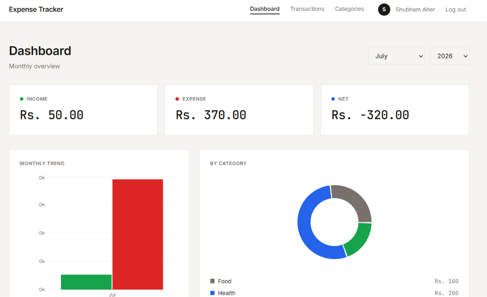
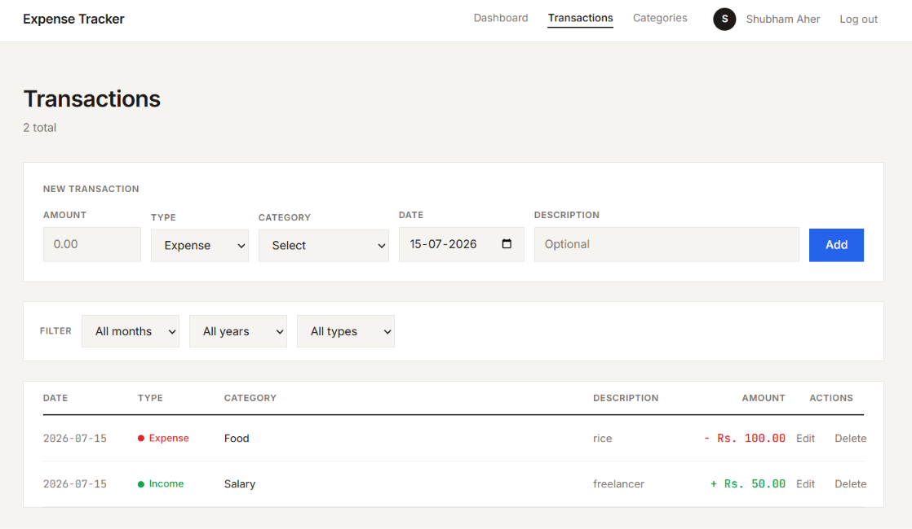
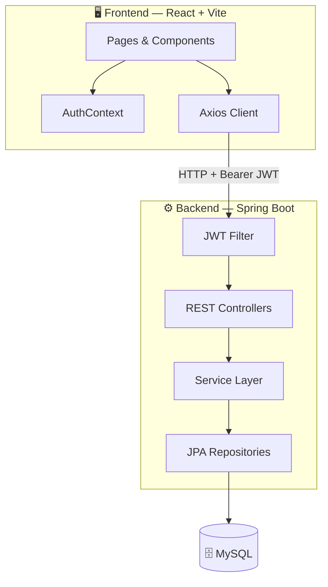
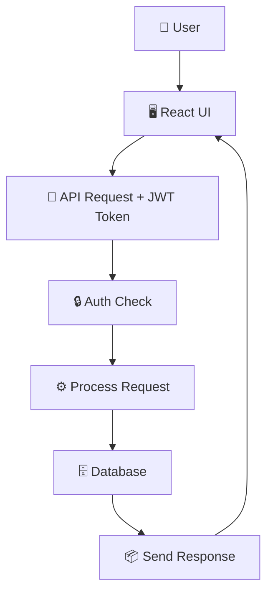
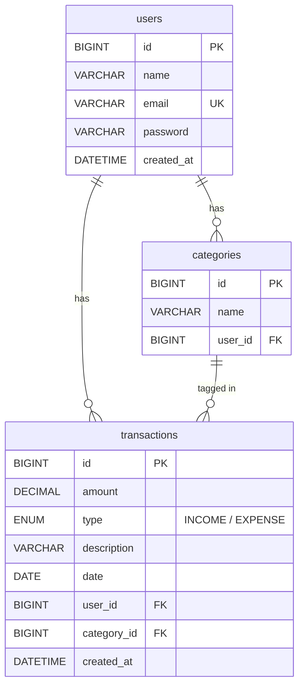

# Spendly — Personal Expense Manager

&nbsp;


## 🚀 Deployment

[](https://spendly.vercel.app/)

[](https://spendly.vercel.app/)


## 🖼️ Screenshots

<table>
  <tr>
    <td align="center">
      
      <br/>
      <b>Dashboard</b>
    </td>
    <td align="center">
      
      <br/>
      <b>Transactions</b>
    </td>
  </tr>
</table>


## ⚡ Overview

Spendly is a full-stack personal finance application built with Spring Boot and React that enables users to securely track their income and expenses with JWT-based authentication. Users can organize transactions by categories, apply filters, and monitor their financial activity through a clean dashboard. 


## ✨ Features

### 📊 **Dashboard & Analytics**
- 💵 Monthly income, expense, and net balance summary
- 🍩 Category-wise expense pie chart with legend
- 📅 Month and year selector for any period

### 💳 **Transaction Management**
- ➕ Add income and expense transactions
- ✏️ Edit existing transactions inline
- 🔍 Filter by month, year, and type

### 🏷️ **Category Management**
- 📂 Create custom categories
- 🌱 6 default categories seeded on registration

### 🔐 **Authentication**
- 📝 User registration with auto-login
- 🔑 Secure login with JWT tokens
- 🚪 Logout with automatic session cleanup

---

## 🛠️ Tech Stack

### Frontend


### Backend


### Deployment


---

## 🏗️ System Architecture



---

## 🔄 System Flow



---

## 🗃️ Database Schema



---

## 📡 API Endpoints

| Method | Endpoint | Auth | Description |
|--------|----------|------|-------------|
| `POST` | `/api/auth/register` | ❌ | 📝 Register new user |
| `POST` | `/api/auth/login` | ❌ | 🔑 Login and get JWT |
| `GET` | `/api/dashboard/summary` | ✅ | 📊 Monthly summary + charts data |
| `GET` | `/api/transactions` | ✅ | 📄 List transactions (paginated + filtered) |
| `POST` | `/api/transactions` | ✅ | ➕ Create transaction |
| `PUT` | `/api/transactions/:id` | ✅ | ✏️ Update transaction |
| `DELETE` | `/api/transactions/:id` | ✅ | 🗑️ Delete transaction |
| `GET` | `/api/categories` | ✅ | 📂 List user's categories |
| `POST` | `/api/categories` | ✅ | ➕ Create category |
| `DELETE` | `/api/categories/:id` | ✅ | 🗑️ Delete category |

---

## 🚀 Getting Started

### Prerequisites
- ☕ Java 17 or higher
- 📦 Maven
- 🟢 Node.js (v18 or higher)
- 🐬 MySQL 8.x

### Backend Setup

1. **Clone the repository**
   ```bash
   git clone https://github.com/shubhamaher8/Spendly.git
   cd Spendly
   ```

2. **Create the database**
   ```bash
   mysql -u root -p -e "CREATE DATABASE IF NOT EXISTS spendly;"
   ```

3. **Configure environment**
   ```properties
   # backend/src/main/resources/application.properties
   spring.datasource.url=jdbc:mysql://localhost:3306/spendly
   spring.datasource.username=root
   spring.datasource.password=your_password
   jwt.secret=your_secure_secret_key
   ```

4. **Run the backend**
   ```bash
   cd backend
   mvn spring-boot:run
   ```
   Server starts at `http://localhost:8080`

### Frontend Setup

1. **Install dependencies**
   ```bash
   cd frontend
   npm install
   ```

2. **Start development server**
   ```bash
   npm run dev
   ```
   App runs at `http://localhost:5173`

### Production Build
```bash
cd frontend
npm run build
```

---

## 📁 Project Structure

```
Spendly/
├── backend/
│   ├── src/main/java/com/spendly/
│   │   ├── controller/       # REST API endpoints
│   │   ├── service/          # Business logic
│   │   ├── repository/       # Database queries
│   │   ├── entity/           # JPA entities
│   │   ├── dto/              # Request/Response objects
│   │   └── security/         # JWT + Spring Security
│   └── src/main/resources/
│       └── application.properties
├── frontend/
│   ├── src/
│   │   ├── pages/            # Login, Register, Dashboard, Transactions, Categories
│   │   ├── components/       # Navbar, SummaryCard, TransactionForm
│   │   ├── context/          # AuthContext (JWT state)
│   │   ├── api/              # Axios config with interceptors
│   │   └── index.css         # Design system
│   ├── vite.config.js
│   └── package.json
└── README.md
```

---

## 🔑 Key Highlights

### 🎨 **Clean UI**
- 🎯 Minimal, content-first design
- 📱 Responsive layout for all screen sizes
- 📊 Interactive charts with tooltips
- ⚡ Smooth transitions and hover effects

### 🔒 **Secure**
- 🔐 BCrypt password hashing
- 🎫 JWT-based stateless authentication
- 🛡️ Per-user data isolation
- 🚫 Ownership validation on every mutation

### 📈 **Smart Features**
- 🌱 Default categories seeded on registration
- 🔍 Multi-filter transaction search
- 📄 Server-side pagination
- 🍩 Category-wise spending breakdown

### ⚡ **Performance**
- 🚀 Vite for fast frontend builds
- 📦 Lazy-loaded JPA relationships
- 🔄 Efficient JPQL aggregate queries
- 🗂️ Paginated API responses


## 🤝 Contributing

Contributions are welcome! Please feel free to submit a Pull Request.

1. Fork the repository
2. Create a feature branch (`git checkout -b feature/NewFeature`)
3. Commit your changes (`git commit -m 'Add NewFeature'`)
4. Push to the branch (`git push origin feature/NewFeature`)
5. Open a Pull Request
